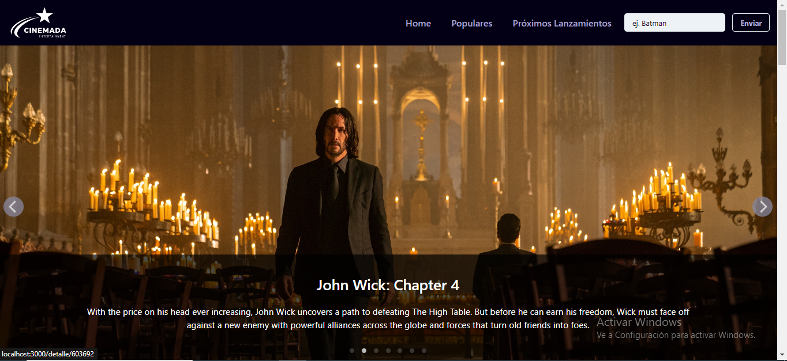
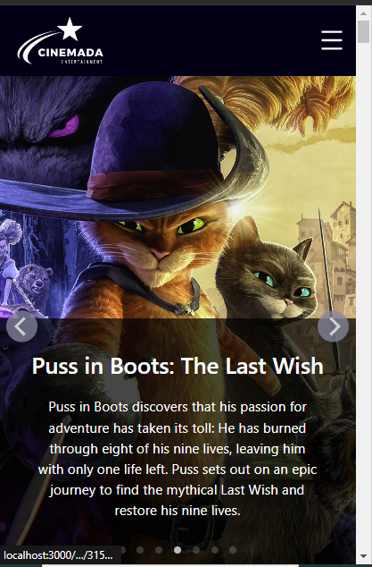

# Movie App 🍿🎬

**Desarrollado por Julieta Bondi e Isabel Alvarado.**

Este proyecto fue desarrollado durante el último módulo de React, es una aplicación para buscar películas utilizando una API para traernos toda la información.

**DISEÑO DESKTOP Y MOBILE**    

  

Utilizamos:
- React
- Chakra
- API TMDB

*Esta aplicación cuenta de varias secciones a las que se pueden ingresar desde el "Navbar"*    

**HOME**    
Acá tenemos un carrousel de imágenes con las películas que se encuentra ahora en los cines, además de las películas 'Populares y Mejor Puntuadas'.    

**PELÍCULAS POPULARES**    
Todas las películas populares.    

**PRÓXIMOS LANZAMIENTOS**    
Todas las películas próximas a estrenar.    

**DETALLE**    
Cada card tiene un botón de 'ver detalles' donde te dirección al detalle de cada película con toda la información (título, géneros, tráiler y descripción).    

Deploy : https://movie-app-five-delta.vercel.app/    

*Para ejecutarlo, hay que clonar este repositorio y en la consola ejecutar:*

### npm install

Luego, para correr la app escribir:

### npm start

Se abrira el navegador en el puerto [http://localhost:3000](http://localhost:3000) 

 
